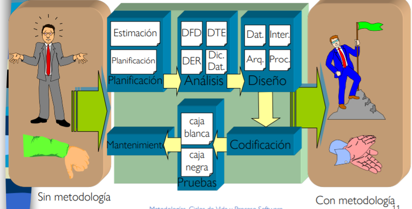
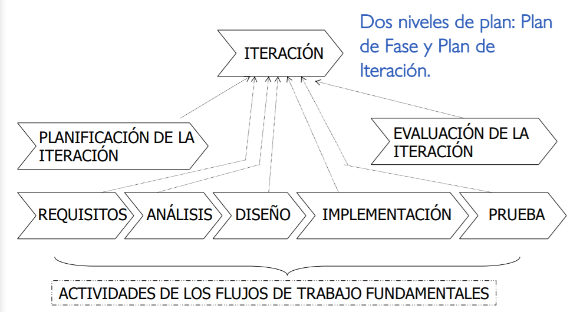

# Metodologías, ciclos de vida y proceso software

## Proceso software
### Definición

*Cuando se trabaja para construir un producto o un sistema, es importante seguir una serie de pasos predecibles - un roadmap que nos permite crear un resultado adecuado y de alta calidad. Ese roadmap es llamado **Proceso software***

*Se considera también un framework para las actividades, acciones y tareas que son requeridas para construir un software de buena calidad*.

## Metodologías
### Definición

*El conjunto de métodos que se utilizan en una determinada actividad con el fin de formalizarla y optimizarla*.

Determinan los pasos a seguir y como realizarlos para finalizar un tarea.

Si aplicamos metodologías a la ingeniería del software: 
* Se **optimiza** el proceso y el producto software.
* Métodos que guían en la planificación y en el desarrollo del software.
* Define qué hacer, cómo y cuándo durante todo el desarrollo y mantenimiento de un proyecto.

## Ciclo de vida
### Definición

*Es el conjunto de fases por las que pasa el sistema que se está desarrollando desde que nace la idea inicial hasta que el software es retirado o remplazado (muere).*

### Funciones

Un ciclo de vida debe:
* Determinar el orden de las fases del proceso software.
* Establecer los criterios de transición para pasar de una fase a la siguiente.
* Definir las entradas y salidas de cada fase.

## Metodología
### Elementos

Un ciclo de vida debe tener los siguientes elementos:
* **Fases**, con sus correspondientes tareas.
* **Productos**, final e intermedios.
* **Procedimientos y herramientas**, apoyo a la realización de cada tarea.
* **Criterios de evaluación**, del proceso y producto para determinar si se han logrado los objetivos.

### Funciones básicas

En todo proyecto lo que se debe hacer es:
1. **definir** el ciclo de vida que más se adecúe a las condiciones y características del desarrollo.
2. **Determinar las fases** dentro del ciclo de vida especificando su orden de ejecución.
3. **Definir los resultados** intermedios y finales.
4. **Proporcionar un conjunto de métdos, herramientas y técnicas** para facilitar la tarea del ingeniero del software y aumentar su productividad.

### Tipos
* **Pesadas o tradicionales**. Las fases están bien definidas, entregas al final, requisitos y planificación bien definidos.
* **Metodologías ágiles**. La interacción con el cliente es continua, se hacen muchas entregas parciales y los ciclos iterativos son más cortos.
* **Modelos centrados en el usuario**. Enfoque e interacción continue con el usuario. Usabilidad y accesibilidad como características de calidad prioritarias.

## Metodologías tradicionales
### Modelo de ciclo de vida en cascada clásico

El proceso de desarrollo de software es una sucesión de etapas que producen prodcutos intermedios. Para que haya éxito deben desarrollarse todas las fases. Las fases continúan hasta que los objetivos se han cumplido. Si se cambia el orden de las fases, producto final será de inferior calidad.

Existen **limitaciones** tales como: *No se permiten las iteraciones*, *los requisitos se congelan* al principio del proyecto y *no se puede visualizar el proyecto hasta el final*. 

### Modelo de refinamiento por pasos

### Proceso unificado
Este proceso permite construir parcialmente el sistema y posteriormente aumentar la funcionalidad del sistema incorporando nuevos requisitos. Esto produce un sistema operacional rápidamente.

* Modelo de ciclo de vida incremental: Se analiza el problema y después se divide en subproblemas, esto implica que el producto software se desarrolla por partes. En cada incremento se agrega más funcionalidad al sistema.
    
    

* Modelo de ciclo de vida iterativo: El refinamiento se hace por pasos aunque, normalmente, se iteran sobre todas las fases cada vez. En cada iteración, se revisa y mejora la calidad del producto.
    
    

## Metodologías métricas

Fue desarrollada en España por el ministerio para la administración pública. Ofrece un marco de trabajo que define una *división del proyecto en fases*, *responsabilidades y funciones de los miembros del equipo*, *conjunto de productos finales*, *conjunto de métodos, procedimientos, técnicas y herramientas aplicables en cada fase*.

## Metodologías ágiles

Ivar Jacobson, describe la agilidad en el software como "*una respuesta efectiva al cambio*". Pero la agilidad no es solo eso. También incluye **estructuras de equipo** y **actitudes** que hacen más fácil la comunicación como la de reflexionar frecuentemente sobre cómo ser más eficaces y mejorar la calidad técnica. Se pone énfasis en la **entrega rápida de software funcional** y se le resta importancia a los productos intermedios de trabajo. Se **adopta al cliente como parte del equipo de desarrollo** y se trabaja para eliminar la actitud de "*nosotros y ellos*".

Entonces, *un proceso software ágil es un proceso que se **adapta** a cambios impredecibles. Esto lo hace de forma **incremental** mediante la retroalimentación con el cliente*.  

Ejemplos de metodologías ágiles son:
* XP (eXtreme Programming)
* KANBAN
* SCRUM

## XP (eXtreme Programming)

Se usa un enfoque orientado a objetos como paradigma preferido de desarrollo, y engloba un conjunto de reglas y prácticas que ocurren en el contexto de 4 actividades estructurales: *Plan*, *diseño*, *codificación* y *pruebas*.
* **Plan**: Comienza escuchando (captura de requisitos), esto lleva a la creación de "**historias**" (historias del usuarios) que describen la salida necesaria, características y funcionalidad del software que se va a elaborar. A cada historia se le asigna una **prioridad** y después los miembros del equipo XP evaluán cada historia y le asignan un costo, medido en semanas de desarrollo. A medida que avanza el trabajo, el cliente **puede agregar historias**, **cambiar la prioridad de una**, **descomponerlas** o **eliminarlas**.
* **Diseño**: Se sigue el principio KISS (keep it simple stupid). En XP se estimula el uso de tarjetas CRC como un mecanismo eficaz para pensar en el software en un contexto orientado a objetos. Las tarjetas CRC (clase-responsabilidad-colaborador) identifican y organizan las clases orientadas a objetos que son relevantes para el incremento actual del software. Se estimula el **rediseño** (*El rediseño es el proceso mediante el cual se cambia un sistema de software en forma tal que no altere el comportamiento extremo del código, pero sí mejore la estructura interna*). El diseño ocurre *antes* y *después* de la codificación.
* **Codificación**: Una vez las historias están hechas y el diseño preliminar está hecho, el equipo **no inicia la codificación**, se desarrollan una seroe de pruebas unitarias para cada una de las historias que se van a incluir en la entrega en curso. Una vez creada la prueba unitaria, se desarrolla el código. En XP es clave la **programación por parejas**, se recomienda que dos personas trabajen juntas en una estación de trabajo con el objeto de crear código para una historia (dos mentes piensan mejor que una). A medida que el código de los desarrolladores va acabando, este se va integrando con los demás.
*  **Pruebas**: Las pruebas que se creán deben implementarse con el uso de una estructura que permita automatizarlas, esto estimula el uso de una estrategia de pruebas de **regresión**.

## SCRUM

Los principios Scrum son congruentes con el manifiesto ágil y se utilizan para guiar actividades de desarrollo dentro de de un proceso de análisis que incorpora las siguientes actividades estructurales: **requisitos**, **análisis**, **diseño**, **evolución** y **entrega**. Dentro de cada actividad estructural, las tareas ocurren con un patrón llamado **sprint**. Se acentúa el uso de patrones de proceso del software, estos definen un grupo de acciones de desarrollo:
* **Retraso**: Lista de prioridades de los requerimientos o características del proyecto que dan al cliente un valor del negocio. Es posible agregar en cualquier momento otros aspectos al retraso.
* **Sprints**: Consiste en unidades de trabajo que se necesitan para alcanzar un requerimiento definido en el retraso que debe ajustarse en un acaja de tiempo predefinida. Durante el sprint no se introducen cambios.
* **Reuniones Scrum**: Son reuniones breves que el equipo Scrum efectúa a diario. Hay 3 preguntas clave que se pide que respondan todos los miembros del equipo:
  * *¿Qué hiciste desde la última reunión del equipo?*
  * *¿Qué obstáculos estás encontrando?*
  * *¿Qué planeas hacer mientras llega la siguiente reunión del equipo?*

  El lider del equipo llamado *maestro Scrum*, dirige la junta y evalúa las respuestas de cada persona.

* **Demostraciones preliminares**: Entregar el incremento de software al cliente de modo que la funcionalidad que se haya implementado pueda demostrarse al cliente.

## Desarrollo centrado en el usuario

El Diseño Centrado en el Usuario (DCU) es una filosofía de diseño que tiene por objetivo la creación de productos que resuelvan necesidades concretas de sus usuarios finales, consiguiendo la mayor satisfacción y mejor experiencia de uso posible con el mínimo esfuerzo de su parte.

El usuario juega un papel fundamental antes, durante y después de la construcción del software.

El objetivo principal es el aseguramiento de la **usabilidad** del sistema final.
Fases generales de Modelos de Procesos Centrados en el Usuario:
* Conocer a fondo a los usuarios finales.
* Diseñar un producto que resuelva sus necesidades y se ajuste a sus capacidades, expectativas y motivaciones.
* Poner a prueba lo diseñado, normalmente usando test de usuario.

### Usabilidad

Medida en la que un producto se puede usar por determinados usuarios para conseguir objetivos específicos con efectividad, eficiencia y satisfacción en un contexto de uso especificado.

Métricas generales de la Usabilidad:
* Exactitud: Número de errores cometidos por los sujetos de prueba y si estos fueron recuperables o no al usar los datos o procedimientos adecuados.
* Tiempo requerido para concluir la actividad.
* Recuerdo: Qué recuerda el usuario después de un periodo sin usar la aplicación.
* Respuesta emocional: Cómo se siente el usuario al terminar la tarea (bajo tensión, satisfecho, molesto, etc).

La **Accesibilidad** es un caso específico de Usabilidad. Necesita mayor involucración de los usuarios en todas las fases del proyecto y el desarrollo es *Universal* o *para todos*.
