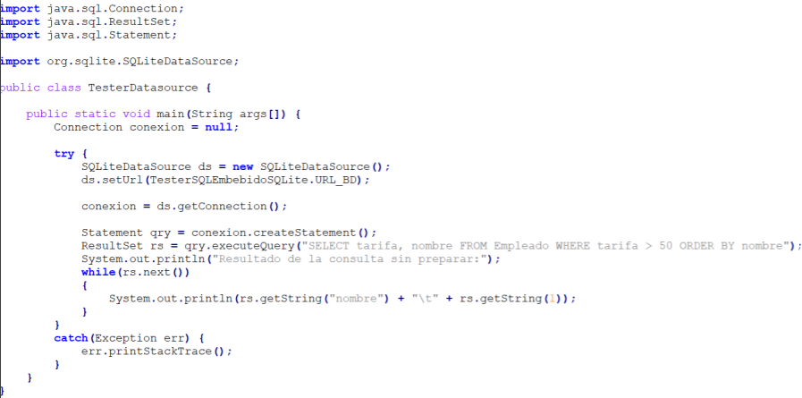
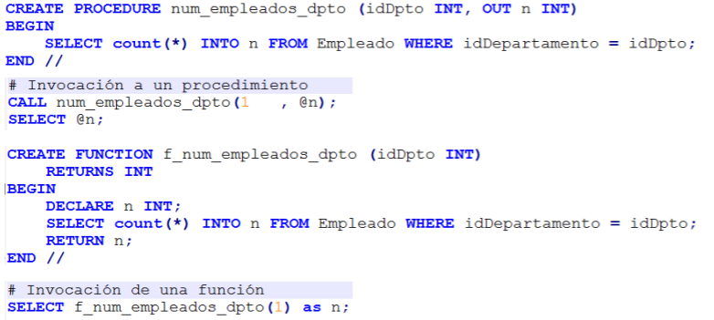
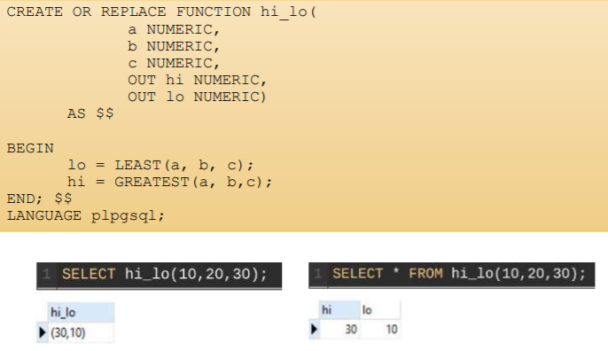
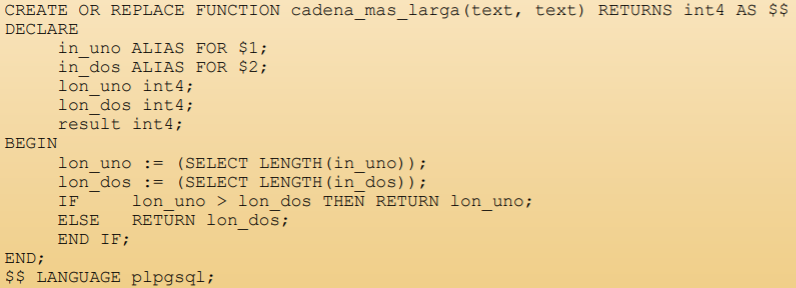
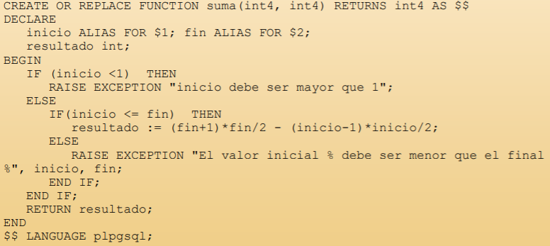
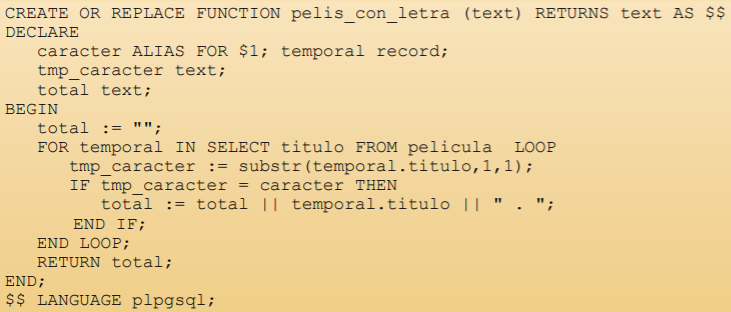
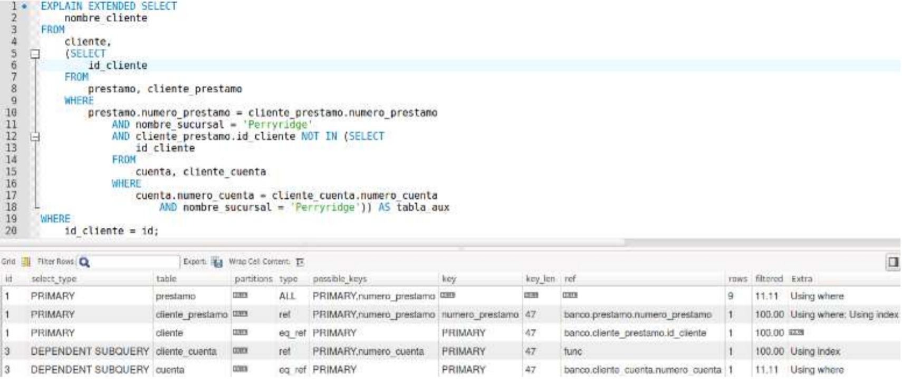

# Gestión de datos distribuidos

El concepto de "base de datos distribuida"/"base de datos como sistema distribuido" tiene varias acepciones:
* Un sistema cliente-servidor donde los datos se encuentran en un único o distintos servidores.
* Un sistema cliente-servidor o P2P donde los datos se encuentran en un sistema distribuido. Base de datos distribuida.

## Gestores de bases de datos
Sistema que se encarga de la organización, almacenamiento, gestión y recuperación (eficiente) de la información. En estos gestores se incluye:
* Un lenguaje para modelar la información de acuerdo a un determinado modelo (*__DDL__, Data Definition Language*).
* Estructuras de almacenamiento de la información optimizadas para trabajar con un **gran volumen de datos**.
* Un lenguaje para recuperar/manipular la información almacenada mediante busquedas dirigidas (*__DML__, Data Manipulation Language*).
* Los mecanismos adecuados que le permitan integrarse en un sistema de acceso con **control transaccional**.

En la actualidad, el modelo más habitual de gestores de bases de datos es el que sigue el **modelo relacional**, usando como lenguaje **SQL** (*Structured Query Language*). Hay que tener en cuenta que aunque hay una definicion ISO para SQL, cada SGBD tiene una versión con pequeñas diferencias.

Algunos ejemplos de gestores de bases de datos son: *IBM DB/2, Oracle, Sybase, Microsoft Access, Microsoft SQL Server, PostgreSQL, MySQL, MariaDB...*.

### Acceso de datos
En antaño, los datos se guardaban a través de un conjunto de ficheros. Los problemas con respecto a esta forma de guardar datos son los siguientes:
* **Volumetría**: Si se manejan muchos datos el fichero se hace enorme.
* **Redundancia** e **inconsistencia** en los datos.
* El acceso a los datos es **ineficiente** ya que existen varios formatos y la información puede estár duplicada en diferentes ficheros.
* Los datos **no están aislados** (esto significa que si la estructura de los datos varía hay que modificar los programas).
* Problemas de **integridad** ya que es difícil añadir nuevas restricciones o variar las que se establecieron inicialmente, y las restricciones tienen que ser reforzadas en cada programa y no por la base de datos.
* La **atomicidad** de las modificaciones es difícil de asegurar.
* Se debe permitir el **acceso simultáneo** para ganar velocidad de proceso, pero se a de asegurar que dos actualizaciones no son conflictivas.
* La **seguridad** es otro problema por que es difícil restringir parcialmente el acceso a datos.
  
## Bases de datos relacionales en entornos distribuidos

Una base de datos que se ajusta al modelo relacional puede representarse como un conjunto de tablas; a parte, los diagramas E-R (entidad-relación) pueden convertirse a tablas, este es el primer paso para obtener una base de datos relacional.

## Lenguajes de SQL

* **DDL**, lenguaje de definición de datos en el que se definen los *esquemas de relación*, *borrado de relaciones*, *creación de índices*, *modificación de esquemas de relación*, *Órdenes para la definición de vistas*, *Órdenes para especificar las restricciones de integridad que deben cumplir los datos almacenados en la base de datos*, *Órdenes para especificar derechos de acceso para las relaciones y vistas*... Se permite la creación y destrucción de tablas. En el DDL también se incluyen:
  * *Check*, restricción arbitraria.
  * *Not Null*, el atributo no acepta valores nulos.
  * *Unique*, el atributo no acepta valores repetidos.
  * *Primary key*, el atributo es clave primaria.
  * *Foreign key*, el atributo es clave extranjera.
* **DML**, lenguaje de manipulación de datos. Se incluye un lenguaje de consultas basado en álgebra relacional, se incluyen órdenes para insertar (*INSERT*), borrar (*DELETE/TRUCTATE*), modificar (*UPDATE*) y seleccionar (*SELECT*) (CRUD) tuplas en la base de datos.

### Agregaciones y agrupaciones
Las agregaciones más comunes son *SUM*, *AVG*, *MIN*, *MAX*, *COUNT*. Estos son operador que calculan un valor único a partir de una columna de valores. Las agregaciones se pueden aplicar mediante *filtros* o *agrupaciones*.

### Cruces de tablas (JOIN)
En un cruce se toman 2 o más relaciones y se obtiene otra relación, en principio con todos los atributos de las relaciones que se han cruzado.

**BUSCAR EN GOOGLE LOS DIFERENTES TIPOS DE JOIN**

### Combinación de relaciones (UNION, INTERSECT, EXCEPT)

Permite combinar 2 o más relaciones compatibles. Estos operadores por defecto eliminan las filas duplicadas, pero si se usa ALL estas no se eliminan.

### Subconsultas

Pueden aarecer subconsultas como parte de la condición descrita en la clausula WHERE, o en la clausula FROM sustituyendo una relación ya almacenada.

### Procesamiento de una consulta

1. Crear producto cartesiano descrito en FROM.
2. Aplicar las restricciones descritas en WHERE.
3. Si no hay GROUP BY, proyectar la relacion según select describe.
3.1 Agrupar las tuplas por valores tal y como especifica GROUP BY.
4. Aplicar HAVING.
5. Aplicar SELECT.

## Acceso a datos desde la aplicación

El **SQL interactivo** se define como el uso de SQL en el cliente del SGBD.

Las aplicaciones no acceden a datos almacenados en bases de datos relacionales a través de SQL interactivo si no a través de un *middleware*, el **driver de la base de datos**. Este driver es específico del SGBD y es un leguaje de alto nivel.

Existen varios **mecanismos de acceso de datos**:
* **SQL embebido** (inmerso/incrustado) en el código. Las sentencias SQL están incrustadas dentro del propio código mediante strings.
* **Sentencias preparadas**. Sentencia SQL precompilada que acepta parámetros, mejora el tiempo de respuesta y/o la seguridad, y es útil cuando una misma sentencia se utiliza varias veces.
* **DataSources lógicos**. Patrón de diseño que mejora la reusabilidad/mantenibilidad, y herramienta de acceso a datos que mejora los tiempos de acceso.

Estos mecanismos han *evolucionado*:
* Existe la **separación de responsabilidades** en el diseño. Esto mejora la legibilidad y la mantenibilidad del código. Se añaden frameworks y bibliotecas que permiten que las sentencias SQL no aparezcan inmersas en el código funcional.
* **ORM** *Object-Relational Mapping*. Es una abstracción del acceso a datos. Fue inicialmente parte del diseño de la aplicación, en la actualidad, en muchos casos se gestiona automáticamente. Son frameworks de persistencia que alamacenan y recuperan objetos de una base de datos relacional de forma transparente para el programador de la lógica de negocio. La capa de persistencia se invoca como a cualquier otro elemento de la lógica de negocio (el código SQL no existe).

El *SQL EMBEBIDO* también está en **PHP**, se usa **PDO** (*PHP Data Object*). Esta es una extensión de PHP para crear acceso uniforme a base de datos. Para establecer una conexión con la base de datos se crea una instancia de la clase PDO pasando al constructor distintos parámetros en función del SGBD.
Para interactuar con la base de datos se usa el método **PDO::exec**, se utiliza con las sentencias SQL que no devuelven un conjunto de resultados. También se puede usar el método **PDO::query** para obtener datos de la base de datos. Otros métodos son:
* *fetch (retorna la proxima fila)*.
* *fetchAll (retorna un array con todas las filas)*.
* *fetchColumn (retorna un solo campo de la próxima fila)* .
* *fetchObject (retorna la próxima fila como un objeto)*.
* *execute (ejecuta una sentencia preparada)*. 
* *bindColumn (liga una col)*.

Los resultados pueden ser devueltos de distinta forma dependiendo del modo que se especifique con el método **setFetchMode**:
* **PDO::FETCH_NUM**: Array indexado numéricamente.
* **PDO::FETCH_ASSOC**: Como array asociativo.
* **PDO::FETCH_OBJ**: Como objeto.
```php
$stmt = $db->query($sql);
$result = $stmt->setFetchMode(PDO::FETCH_NUM);
while ($row = $stmt->fetch()) {
  print $row[0] . "\t" . $row[1] . "\t" . $row[2] . "\n";
}
```

En **JAVA** el *SQL EMBEBIDO* también está. En concreto está incluido en la JDK (*Java Development Kit*) desde la versión 1.4, *java.sql.DataSource*. Está es la forma recomendada de obtener una conexión con la base de datos ya que ofrece ventajas frente a obtenerla del *DriverManager*. Las ventajas son:
* Facilidades para el registro y la inyección de dependencias.
* Pool de conexiones.
* Transacciones distribuidas.

### EJEMPLO 1:
```java
import java.sql.DataSource;
import java.sql.Connection;
DataSource ds = MyDataSourceFactory.getDataSource();
Connection conexion = ds.getConnection();
```

### EJEMPLO 2:


### Separación de responsabilidades
Antiguamente se usaba **iBatis** hasta la versión 3.0. MyBatis es un framework de persistencia que soporta SQL, procedimientos almacenados y mapeos avanzados.

**Hibernate ORM** permite a los desarrolladoes a escribir aplicaciones cuyos datos se escapan del proceso de la aplicación.

**SQLAlchemy** es una herramienta y mapeador de objetos relacionados para **python**. Da a los desarrolladores poder absoluto y la flexibilidad de SQL.

**DJANGO ORM (Object-Relational Mapping)** son clases que heredan de *django.db.models.Models*. El modelo de datos lógico se convierte automáticamente en un modelo de datos físico en el SGBD.

## Procedimientos almacenados y Triggers
Existen 2 formas de definir funcionalidad de usuario dentro de una base de datos distribuida SQL.
* **Funciones y procedimientos almacenados**: Se ejecutan a petición del usuario.
* **Triggers**: Se ejecutan cuando ocurre un evento asociado a una tabla.

Ambas funcionalidades son un conjunto de sentencias SQL y lógicas, de programa compilado, verificado y almacenado en el SGBD. Son tratadas por el sevidor como cualquier otro objeto de la base de datos y almacenado en el catálogo de la misma.

Hay que aclarar que **NO TODOS LOS SGBD** lo soportan y:
* **No hay estandares** con respecto a la implementación de cada fabricante.
* PL/SQL (*Procedural Language for SQL*) es una definicion de lenguaje incorporado en Oracle 6 que posteriormente ha sido asumida por otros fabricantes.
* PostgreSQL soporta funcionalidad dentro de la base de datos **desde 1997**.

Las funciones y procedimientos almacenados:
* **Mejoran el rendimiento** frente a la ejecución de comandos SQL desde la aplicación.
* Su **acceso está controlado** por los mecanismos de seguridad.
* Aceptan **parámetros de entrada**.
* Los **procedimientos se invocan**, las **funciones se incluyen dentro de una sentencia SQL**.
* La **sintaxis se valida en tiempo de ejecución**, no durante la creación.

### Procedimiento Almacenado


### Función


### Función 2
```sql
CREATE OR REPLACE FUNCTION trae_pelicula (integer) RETURNS text AS $$
DECLARE
pelicula_id ALIAS FOR $1;
encontrada_pelicula pelicula%ROWTYPE;
BEGIN
SELECT INTO encontrada_pelicula * FROM pelicula WHERE id = pelicula_id;
RETURN encontrada_pelicula.titulo || " (" || encontrada_pelicula.agno || ")";
END;
$$ LANGUAGE plpgsql; 
```

### Salida en tuplas


### IF


### BUCLES WHILE


### Excepciones


### Cursores


Los **triggers** se pueden considerar un tipo especial de procedimiento almacenado, la principal diferencia es que **un trigger se invoca de forma automática en respuesta a una modificación** de datos en una tabla. Es un mecanismo alternativo para validar la integridad de los datos, también ofrece una funcionalidad equivalente a un planificador de tareas dentro de la propia base de datos. Es un mecanismo sencillo para realizar una auditoría de datos independiente de la aplicación.

```SQL
CREATE OR REPLACE FUNCTION tr_function()
RETURNS TRIGGER
AS $$
BEGIN
NEW.c3 = NEW.c1 + NEW.c2
RETURN NEW
END;
$$
LANGUAGE 'plpgsql';

CREATE TRIGGER tr
BEFORE INSERT ON tableName
FOR EACH ROW EXECUTE
PROCEDURE tr_function();
```

## Optimización de consultas
En la actualidad la volumetría de los datos es enorme, es por esta razón que tenemos varias tipos de acceso a los datos en las bases de datos:
- **Online**: Es un sistema de procesado que maneja transacciones en tiempo real y devuelve una salida lo antes posible.
- **Offline/Batch**: Es un sistema de procesado que maneja grandes cantidades de datos en un momento determinado por una rutina.

### Explain plan
Las sentencias SQL usan **planes de ejecución**, estas definen la forma en la que el SGBD busca o inserta los datos. Gracias a este plan de ejecución podemos identificar cuellos de botella en la ejecución de una consulta.

Estos planes de ejecución no están siempre actualizados, es por esta razón que es necesario hacer un **recálculo de estadísticas** después de cada gran actualización, así el motor del SGBD actualiza el la información sobre el contenido de las tablas.

```sql
ANALIZE TABLE -- MySQL
ANALIZE -- PostgreSQL
```

El **explain plan en MySQL** se utiliza usando **EXPLAIN**, esto devuelve un plan de acceso de una sentencia SQL en forma de tabla: 
- Cada fila contiene información de las tablas (físicas o no) empleadas en la consulta. 
- El orden de las tablas indica el orden en el que se procesarían en la consulta.
- Al usar **SHOW WARNINGS**, se muestran mensajes adicionales del optimizador.



Existen también **estrategias de acceso**:
- *Directo/Constante* (**CONST**): Tablas con un solo registro. Por valor en índice.
- *Cruce por clave única* (**EQ_REF**).
- *Clave no única* (**REF**).
- *Merge de índices* (**INDEX_MERGE**).
- *Clave única en subconsulta* (**UNIQUE_SUBQUERY**).
- *Clave no única en subconsulta* (**INDEX_SUBQUERY**).
- *Rango en índice* (**RANGE**): =, <>, >, >=, <, <=, IS NULL, BETWEEN, LIKE o IN.
- *Full index scan* (**INDEX**).
- *Full table scan, secuencial* (**ALL**).

### EJEMPLOS DESDE DIAPOSITIVA 78.

## Entornos de computación distribuida para grandes volúmenes de datos
### BIG DATA
El big data permita obtener información útil a partir de volúmenes de datos muy grandes.

La razón por la que el big data se ha hecho tan popular ahora es por el incremento exponencial en la cantidad de datos generados y disponibles. A parte aparecen tecnologías de bajo coste que permiten su almacenamiento y procesamiento.

En el big data hay 3 V's principales:
* **Velocity**: Se refiere a la velocidad de los datos.
* **Volume**: GB, TB, PB...
* **Variety**: Para apps, web, tecnología social...

Actualmente se añaden 2 V's más:
* **Veracity**.
* **Value**.

Uno de los problemas del big data es la **volumetría**, cada vez hay más datos y se generan más datos. La **capacidad de procesamiento y almacenamiento** es otro problema ya que no es suficiente para algunas casuísticas.

Para aumentar la V de *volumen* es necesario proporcionar **escalabilidad** en cuanto el almacenamiento y también en cuanto a la velocidad. Tenemos 2 tipos de escalabilidad:
* **Horizontal**: Se distribuye la carga de trabajo entre varios ordenadores conectados entre sí. Normalmente estos ordenadores son baratos.
  * *Ventajas*: Los** límites son mucho más altos** ya que pueden haber miles de ordenadores conectados. El aumentar de capacidad **no es tán caro**. Normalmente la escalabilidad es lineal.
  * *Desventajas*: Requiere de software especificamente diseñado e implementado para ejecutarse en varios ordenadores a la vez.
* **Vertical**: Se incrementa la potencia de la máquina en la que se ejecuta software ya sea mediante nuevos componentes o cambiando el ordenador completo.
  * *Ventajas*. Si el software está preparado, es **más facil de escalar**.
  * *Desventajas*. Aunque el software esté preparado, tarde o temprano encontraremos limitaciones, una de ellas el **precio**.

### TEOREMA CAP
La escalabilidad horizontal implica cierta probabilidad de que falle uno de los nodos conectados o la comunicación entre ellos. En estas condiciones hay 3 propiedades deseables:
* **Consistencia**: Que todos los nodos contengan valores consistentes entre si en todo momento.
* **Disponibilidad (Availability)**: Garantía de que cada petición a un nodo reciba una confirmación de si ha sido o no resuelta satisfactoriamente.
* **Particionado (tolerancia al particionado)**: Que pueda fallar un nodo o conexión y el sistema funcionando.

El teorema CAP dice que es imposible que un sistema ofrezca las 3 propiedades simultáneamente, solo se pueden cubrir 2 de ellas. Por ejemplo **MongoDB** sistemas CP.

El problema de tener varios servidores, es que suelen caerse. El procesamiento distribuido en un contexto de big data requiere el uso de modelos computacionales no estándar cuyo objetivo es simplificar tareas  de programación complejas. La primera tecnología que tuvo éxito fue **Apache Hadoop**. Apache Hadoop es una implementación de código abierto del modelo de programación ***MapReduce***, el cual está basado en el sistema de ficheros **HDFS (Hadoop Distributed File System)**, que a su vez están basados en publicaciones de trabajos de investigación de Google. Ambas ideas fueron implementadas para un motor de búsqueda e indexación (Apache Nutch) por Doug Cutting.

Hadoop cubre las necesidades de almacenamiento y procesamiento masivo de datos, las tareas se ejecutan en una red (cluster hadoop) de ordenadores conectados entre sí (nodos) que se reparten la tarea.

**HDFS (Hadoop Distributed File System)** permite aprovechar y trabajar con la capacidad total de almacenamiento de todos los ordenadores a la vez, mostránsdonosla como si fuera uno solo. Es un sistema de almacenamiento tolerante a fallos (lo consigue gracias a la replicación).

**MAPREDUCE**
1. Se divide el problema en problemas menores (etapa *Map*).
2. Luego los problemas más pequeños son resueltos paralelamente.
3. El conjunto de soluciones a los problemas menores es sintetizado en una solución al problema original (etapa *Reduce*).


Hadoop, a parte, tiene un **ecosistema** ya que tiene una serie de sistemas de apoyo y complementos.
* Sqoop. Transferencia de ficheros entre HDFS y bases de datos.
* Flume. Transferencia de datos generados de forma continua a ficheros HDFS.
* Oozie. Permite definir y ejecutar flujos de trabajo sobre Hadoop.
* Hive. Motor SQL sobre ficheros HDFS.
* Cludera Impala. Funcionalidad equivalente a Hive pero puede llegar a ser 100 veces más rápido.
* Pig. Permite utilizar un lenguaje más sencillo que MapReduce en java (Pig Latin) para procesar datos.
* Hue. Interfaz gráfica para componentes principales de Hadoop.

MapReduce tiene **limitaciones**. Una de estas es la **complejidad** aunque reduce la dificultad de la programación paralela, su implementación es a bajo nivel y no trivial. Es **rigido** las soluciones siempre se deben expresar en 2 etapas con semántica muy estricta, esto a veces obliga a soluciones forzadas y poco naturales. Por último, es **antiguo**.

La principal alternativa a *Hadoop* es **Apache SPARK**.

Continuar con NOSQL. diapo 120
