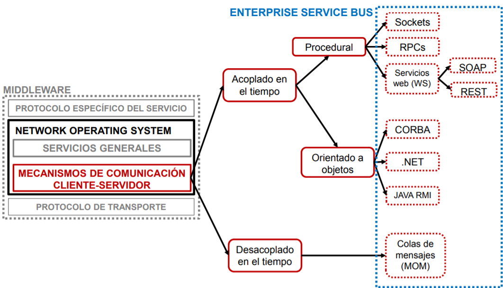
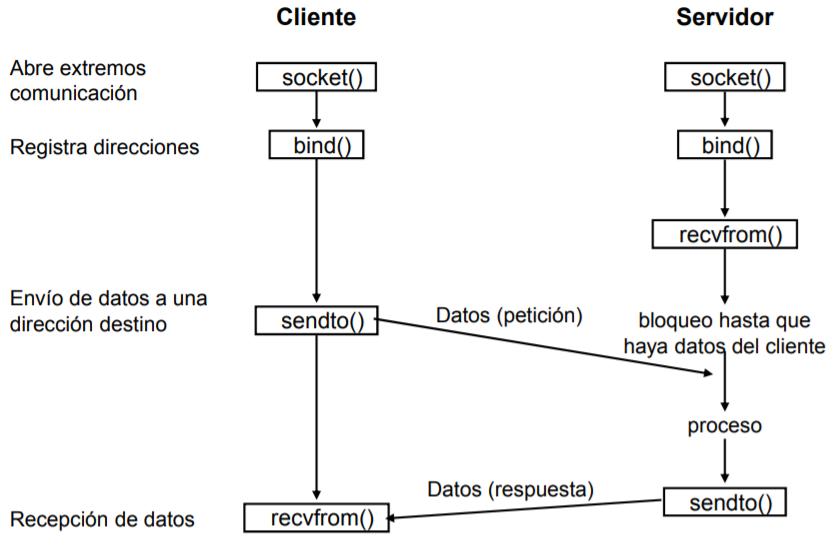
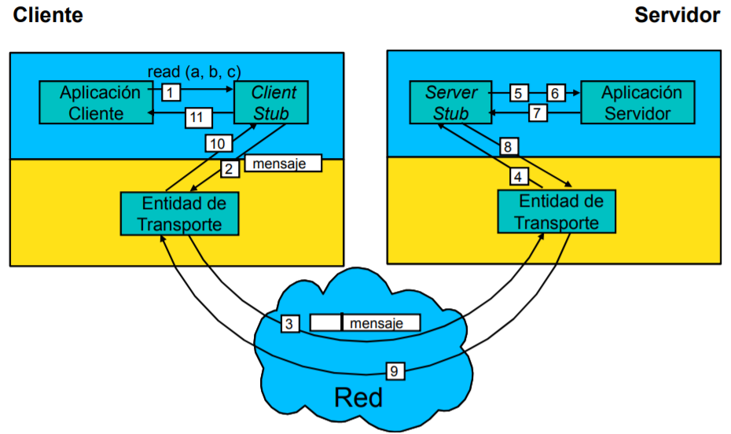
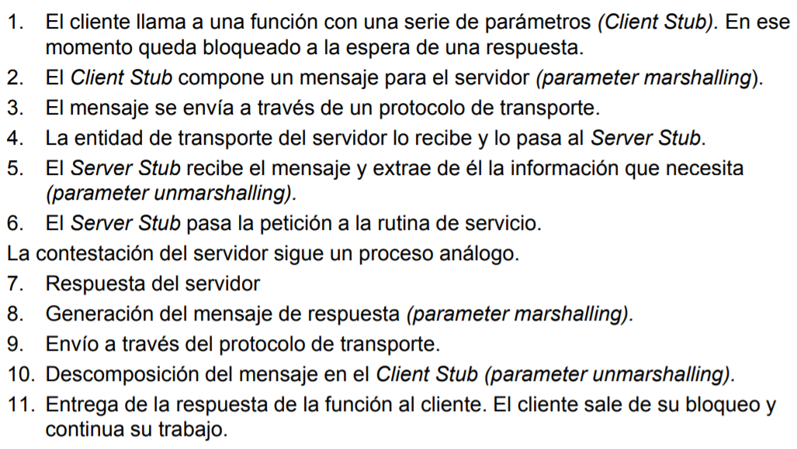

# Tema-1: Middleware

Se define el *middleware* como el conjunto de aplicaciones encargadas de enlazar componentes en un sistema distribuido. Se puede considerar que se divide en 3 capas:
* Protocolos específicos del servicio especiales para distintos tipos de sistemas cliente/servidor.
* Network Operating System, NOS.
* Protocolos de transporte comunes a otras aplicaciones (TCP/IP...).

## NOS. Network Operating System

Es el encargado de proporcionar una apariencia de sistema único a un sistema distribuido. Cuando el cliente realiza una llamada a un servicio (la hace como si fuera local), el NOS:
* Intercepta la llamada.
* Redirige la llamada al servidor.
* Contesta.

El NOS proporciona transparencia a los procesos que lo utilizan mediante las formas definidas por RM-ODP (Open Distributed Processing Reference Model - ISO 10746):
* **De acceso**: Oculta las difrencias en la representación de los datos y llamadas a procedimientos.
* **De ubicación**: Oculta dónde reside cada recurso.
* **De movilidad**: Oculta que un recurso puede moverse a otra ubicación.
* **De reubicación**: Oculta que un recurso puede moverse a otra ubicación mientras está siendo utilizado.
* **De persistencia**: Oculta la activación y desactivación de objetos desde un soporte de datos permanente.
* **De replicación**: Oculta el uso de múltiples ejemplares de cada recurso para aumentar fiabilidad y prestaciones.
* **Frente a fallos**: Oculta el fallo y recuperación de un recurso.
* **De concurrencia o de transacción**: Oculta el uso de un recurso de modo concurrente por varios procesos.

Otras características deseables son:
* **De prestaciones**: Reconfigurar el sistema para mejorar sus prestaciones según la carga de trabajo.
* **De escalado**: Expansión del sistema en tamaño sin cambiar su estructura o los algoritmos de la aplicación.
* **Espacio de nombres**: Las convenciones de los nombres de los recursos deben ser iguales, independientemente del sistema que los soporte.
* **Conexión**: Un único usuario y contraseña para todo el sistema. Sólo se debe introducir una vez.
* **Tiempo**: El mismo en todo el sistema. Los relojes de todos los elementos del sistema cliente/servidor deben estar sincronizados.
* **Administración**: Un único sistema de gestión de todos los recursos.
* **Protocolos**: Idéntica interfaz de programación para todos los protocolos de transporte.

Otro inconveniente dentro de los sistemas distribuidos son los propios datos, ya que estos se representan en una forma u otra dependiendo del ordenador, su hardware o su SO. Para evitar el problema del formato de representación de datos, tanto el cliente como el servidor deben ponerse previamente de acuerdo en el formato en que se van a intercambiar los datos (idioma común). Hay 3 alternativas sobre el acuerdo a tomar:
1. **Mecanismo de representación de datos independiente de la plataforma**. Antes de la transmisión los datos se convierten a un formato genérico conocido por todos los precesos (idioma común). Existen 2 procesos en relación a este formato:
     * **Marshalling**: El emisor convierte los datos del formato local al formato común.
     * **Unmarshalling**: El receptor convierte el formato común al formato local de su arquitectura.
2. Para la comunicación entre dos ordenadores con arquitectura común, el paso anterior puede omitirse. Esto requiere que antes de la transmisión de los parámetros, los dos extremos negocien si se requiere pasar los datos a un formato genérico o no.
3. Transmisión de los datos en su formato nativo junto con un identificador del tipo de arquitectura subyacente. El receptor decide si es necesario convertir los datos recibidos o no.

En el caso 1, se ha hablado de **un mecanismo de representación de los datos independiente de la plataforma**, existen distintos:
* **Sistemas propios de aplicación o protocolo**. Ejemplos: *External Data Representation (XDR)*, *Network Data Representation (NDR)*.
* **Estándar Abstract Syntax Notation 1 (ASN.1)**. Orientado a optimizar la compactación de la información y su codificación y decodificación por los nodos de la red.
* **XML**. Orientado a la interpretación humana de la inforamción.
* **JSON**. Formato legible y ligero para el intercambio de datos.
* **Codificación de caracteres**: Ejemplo, *UTF-8*.

### Mecanismos de comunicación cliente-servidor

Tenemos 2 modelos de interacción:
* **Síncrono**: El cliente envía una consulta y espera hasta que se le devuelven los resultados.
* **Asíncrono**: El cliente continúa su proceso tras realizar una consulta. Los resultados se envína cuando están disponibles.

También tenemos protocolos de intercambio:

### APIs directas
Uso directo a una interfaz de programación para acceder a los servicios de comunicaciones. Habitualmente los servicios son de nivel de transporte o sesión, las comunicaciones son orientadas a conexión (datagramas), la ubicación en los extremos no es transparente para el programa ("*close to the wire*").

### Sockets
Son incluidos como medio de programación de comunicaciones en el Unix de Berkeley (BSD) versión 4.2 en 1981. Son también adaptados a AT&T Unix como *Transport Level Interface*.

Establecen un camino de comunicación entre:
* Dirección IP origen, Puerto IP origen.
* Dirección IP destino, Puerto IP destino.
* Usan un protocolo (TCP, UDP...).

### Comunicación NO orientada a conexión

### Comunicación orientada a conexión

### Remote Procedure Calls (RPC)

Es la ejecución de un servicio en el cliente la cual se realiza del mismo modo que una llamada a una función local:
* El cliente llama a una función.
* Pasa los parámetros.
* Su proceso se detiene hasta que la ejecución de la función finaliza.
* Recibe la respuesta de la función a través de parámetros y resultado de la función.

### Problemas transparencia

Los principales problemas son:
* **Paso de parámetros**: No es posible pasar parámetros por referencia.
* **Asociación llamada/servidor/proceso en el servidor (*Binding*)**.
* **Semántica de la llamada**. 
  * Tras un *Time Out* no se sabe si la llamada se ha ejecutado o no.
  * Distintos tipos de operaciones:
    * *Idempotentes*: Se pueden ejecutar cualquier número de veces.
    * *No idempotentes*: El resultado varía con el número de veces que se ejecuten.
  * Según las operaciones, la estrategia en las llamadas RPC puede ser distinta:
    * Ejecución exactamente una vez.
    * Ejecución como máximo una vez.
    * Ejecución al menos una vez.
* **Representación de los distintos tipos de datos**.
* **Rendimiento de las llamadas**.
* **Seguridad**.

### RPC en redes IP
Se utiliza como protocolo TCP o UDP. Existe un problema, y es conocer el puerto en el que se escucha el servidor. Para solucionar esto:
1. El programa servidor se registra en *Port Mapper*.
2. El programa cliente pregunta a *Port Mapper* por el puerto.
3. Se establece la conexión en el puerto.